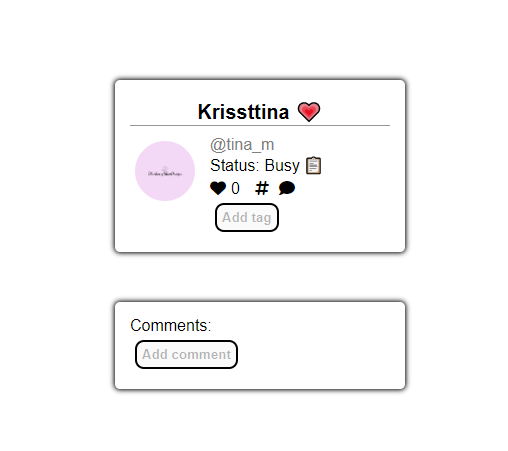
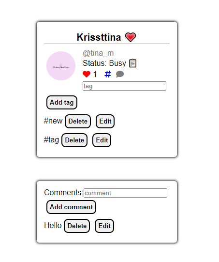
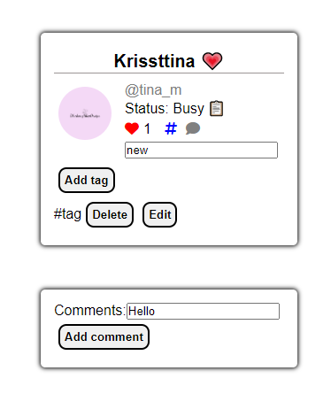

## Twitter duplicate

By clicking on the tag or comment buttons are enabled fields with which adds text in the specific section, by clicking again the buttons are disabled again and the fields disappears. 
By clicking the heart the number is increased and if it's clicked again the number gets decreased.

Every entered text has it's Delete and Edit button.
 

By hitting Delete button the chosen text is deleted.
The Edit button gets the text back to it's field for making the edit and than after being changed it can be added again.

~Last update 24.04.2023